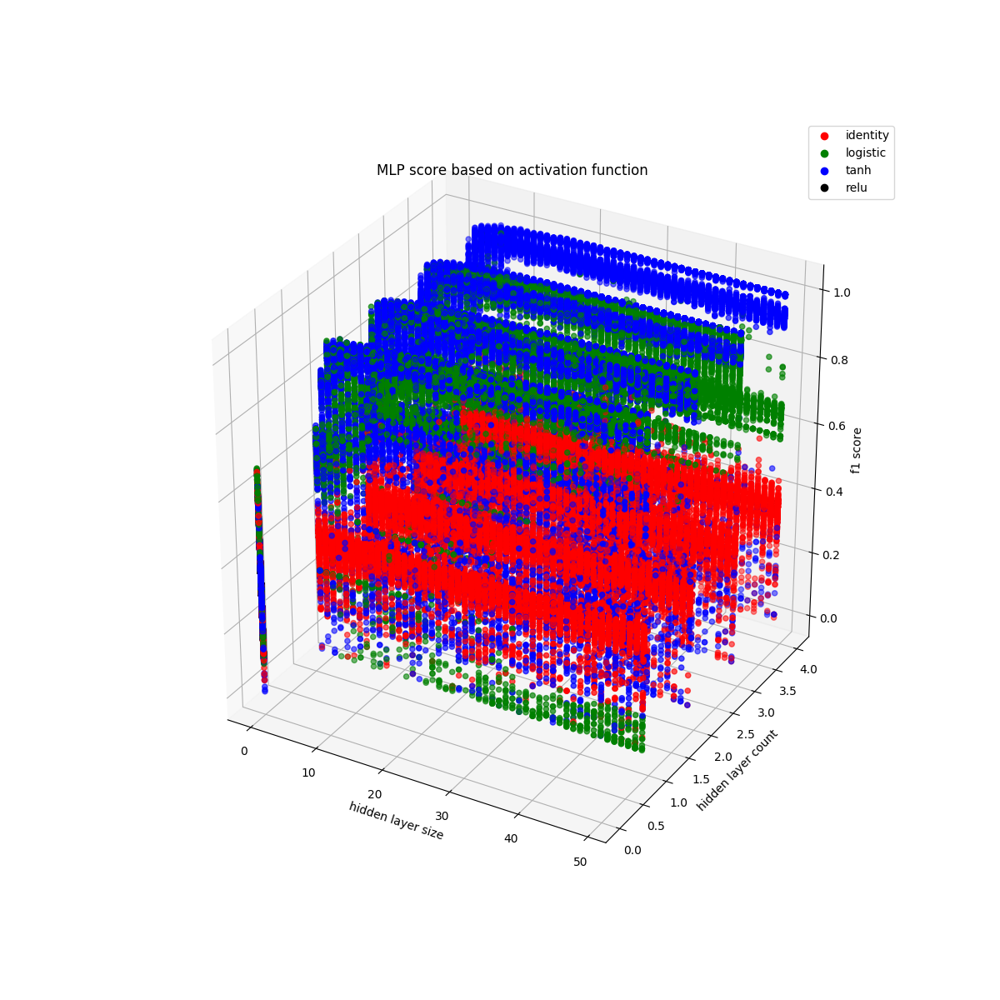

# anomaly
Classification anomaly detection in IOT with Machine Learning

## setup

use a virtual environment with *Python 3.6* and install the modules from [requirements.txt](requirements.txt).

    python -m virtualenv venv
	source venv/bin/activate
	pip install -r requirements.txt

## data prospection

 - [40 Brilliant Open Data Projects Preparing Smart Cities for 2018](https://carto.com/blog/forty-brilliant-open-data-projects-preparing-smart-cities-2018/)
 - [Sci-Hub](http://sci-hub.hk)
 - [Dweet](https://dweet.io/see)
 - [Engage](http://www.engagedata.eu/dataset-search/?q=)
 - [Intel Lab Data](http://db.csail.mit.edu/labdata/labdata.html)

## usage

 You only need two files, [detector.py](detector.py) contains the `Detector` that is used to store and compute datasets. A example of its usage is shown in [main.ipynb](main.ipynb).

  - [body.csv](http://perso.telecom-paristech.fr/ychalier/anomaly/data/body.csv) (source: [Grete Heinz, Louis J. Peterson, Roger W. Johnson, and Carter J. Kerk. Exploring relationships in body dimensions. Journal of Statistics Education, Volume 11, Number 2](http://ww2.amstat.org/publications/jse/v11n2/datasets.heinz.html))
  - [moto.csv](http://perso.telecom-paristech.fr/ychalier/anomaly/data/moto.csv) (sample from the [Motorcycle database](http://www.teoalida.com/cardatabase/motorcycles/) from [Teoalida](http://www.teoalida.com), which is a gathering of data scrapped of [bikez.com](www.bikez.com))
  - [moto2.csv](http://perso.telecom-paristech.fr/ychalier/anomaly/data/moto2.csv) (sample from [motocicliste.net](http://www.motocicliste.net/moto/db.asp))

One may use `scp` to copy databases over a distant server to execute code.

    scp *.csv user@host:path/

## parameters tuning

In order to find the best parameters for each classifier, we use a grid search with cross validation to find the best set of parameters. The class `Detector` now has a method called `tune_parameters` which seeks the best set of selected parameters for a given classifier. This method is used in a small Python script called [parameters.py](parameters.py) that can be run on more powerful servers.

This script outputs a *.out* file that then can be exported as JSON and/or CSV using [beautify.py](beautify.py). You can find examples of those files [here](http://perso.telecom-paristech.fr/ychalier/anomaly/params/).

CSV files are formatted such that a single test batch is split in several files:

 - **.scores.csv**: the detailed scores for each test (including the *confusion matrix*), along with the unique parameters *combination id*.
 - **.params.estimatorName.csv**: for each type of classifier, the value of each parameter for every combination using this classifier, along with the *combination id* used as a foreign key with the scores table.

*Side note: the delimiter for those CSV file is currently `;`.*

The script [process_output.py](process_output.py) processes thoses CSV files to produce relevant plots. Here is an example:

## usage in production

The following [notebook](production.ipynb) shows how to generate the prediction function. Then, the following script only need this file to classify whether the given record is an anomaly or not:

    def classify(class_, length, width):
      import pickle
      file = open('anomaly_classifier.clf', 'rb')
      fun = pickle.load(file)
      file.close()
      if fun(class_, length, width):
          return "malicious"
      else:
          return "non-malicous"
